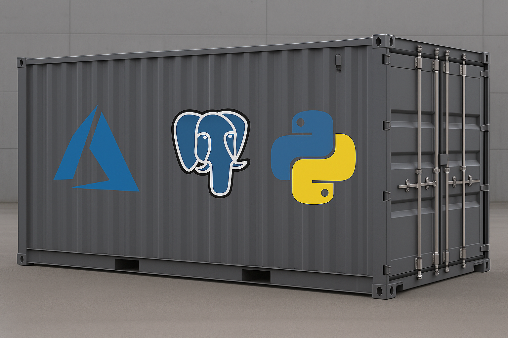
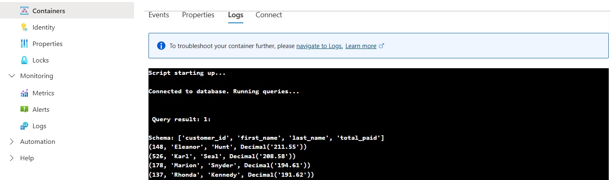
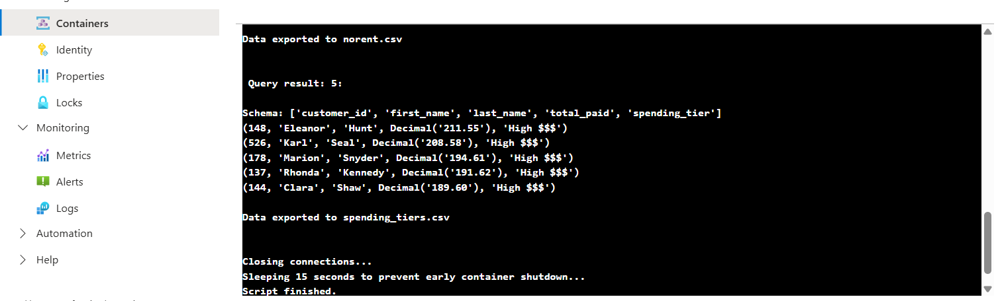

# Shipmint
Shipmint is a data querying and export tool built with Python for running analytical SQL queries on the [dvdrental](https://neon.com/postgresql/postgresql-getting-started/postgresql-sample-database) dataset. It connects to a PostgreSQL database, executes pre-defined queries, and exports the results to CSV files.

This project includes a working **Continuous Integration and Continuous Delivery (CI/CD) pipeline** using GitHub Actions that builds and pushes a Docker image to **Azure Container Registry** and deploys it via **Azure Container Instances**.


<p align="center">
  
</p>


---

## 📂 Project Structure

```bash
.
shipmint/
├── .github/
│   └── workflows/
│       └── deploy.yml
├── .dockerignore
├── Dockerfile
├── LICENSE
├── flyingnimbus.py
├── requirements.txt
├── README.md
```

---

## ⚙️ Features and Technologies:

- **Python**: Scripting and data transformation<br> 
- **PostgreSQL**: Data storage (hosted on Azure)<br> 
- **Docker**: Containerization<br> 
- **Azure Container Registry (ACR)**: Stores Docker images<br> 
- **Azure Container Instances (ACI)**: Runs containers on demand<br> 
- **GitHub Actions**: CI/CD pipeline<br> 

### Python libraries used:<br> 
- `psycopg2` – Used to connect and interact with the PostgreSQL database.<br> 
- `os` – Handles interaction with the operating system, such as environment variables and file paths.<br> 
- `csv` – Used for reading and writing CSV files, primarily for data export/import.<br> 
- `time` – Utilized during development and testing for adding delays (for stuff like while waiting for Azure containers or services to be ready).<br> 
- `dotenv` – Loads environment variables from a .env file, for keeping sensitive configs like db credentials out of source code.<br> 


##  Setup

### 1. Clone the repo

```bash
git clone https://github.com/r-o-bo/shipmint
cd shipmint
```

### 2. Create `.env` file

```env
DB_HOST=your_postgres_host 
DB_NAME=dvdrental
DB_USER=your_username 
DB_PASSWORD=your_password
```

---

## :whale: Running with Docker

```bash
docker build -t flying-nimbus .
docker run --env-file .env flying-nimbus
```

---

These are injected from GitHub Secrets during CI/CD:
```env
DB_HOST
DB_NAME
DB_USER
DB_PASSWORD
ACR_LOGIN_SERVER
ACR_USERNAME
ACR_PASSWORD
AZURE_RG (Resource Group)
AZURE_CLIENT_ID
AZURE_CLIENT_SECRET
AZURE_TENANT_ID
AZURE_SUBSCRIPTION_ID
ACI_NAME
```


---

## 🔧 CI/CD Pipeline


On push to master, the GitHub Actions workflow will:
1. Authenticate with Azure via OIDC.
2. Build and push a Docker image to ACR.
3. Delete any existing container instance.
4. Deploy a new container to ACI.
5. Wait for the container to finish execution.
6. Delete the container (optional cleanup).

<p align="center">
  
</p>

<p align="center">
  
</p>

---

## 📜 License
This project is licensed under the MIT License.

